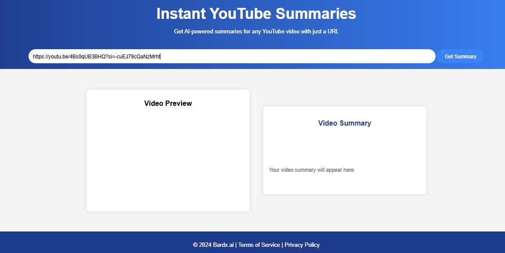
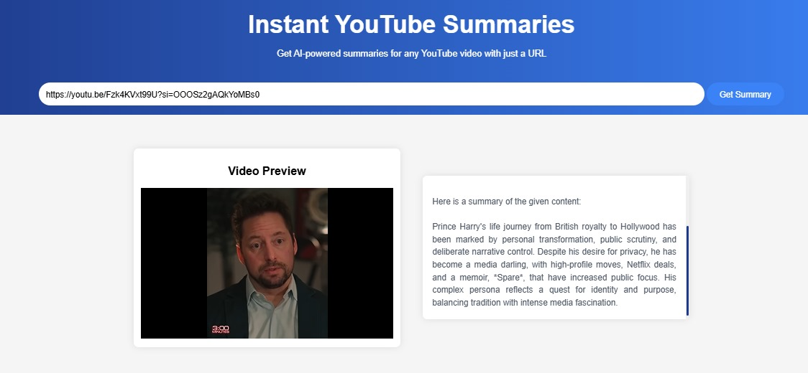
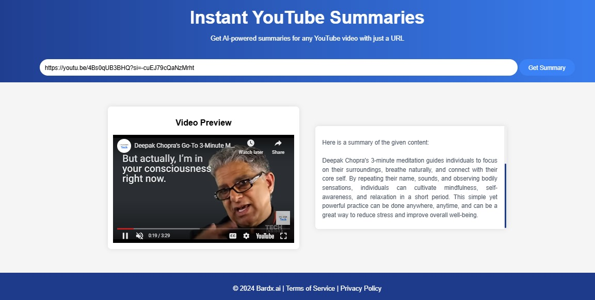
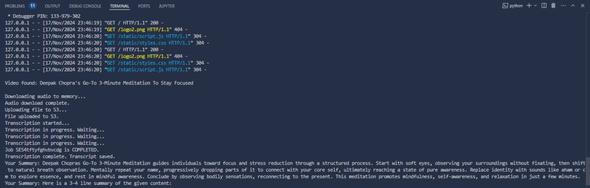

# Clip-Crunch

The ***Clip-Crucnch** is a cutting-edge application designed to streamline the process of extracting key information from YouTube videos, making it easier for users to grasp the essence of long video content without watching it in full. This application allows users to input a YouTube video URL, after which it downloads the video, extracts its audio, transcribes the speech into text using **AWS Transcribe**, and generates a concise summary using **AWS Bedrock**. Built with a robust backend powered by **Python Flask**, the application handles the orchestration of video processing, audio transcription, and text summarization efficiently. The frontend, developed with **HTML/CSS**, provides a clean and intuitive interface where users can easily paste the video URL and view the resulting summary in a structured and user-friendly format. By leveraging the advanced capabilities of AWS for transcription and AI-based summarization, the application ensures high accuracy and reliability in processing. Furthermore, it is deployed on **Microsoft Azure**, utilizing its secure and scalable infrastructure to offer a seamless experience for users. With its ability to transform lengthy video content into digestible summaries, the YouTube Video Summarizer is ideal for educational purposes, business applications, and quick content consumption, enabling users to save time and focus on the most critical information. This project exemplifies the integration of modern cloud services with web development to deliver an efficient, scalable, and user-centric solution.

---

## Features

1. **YouTube Video Download**  
   - Utilizes the `pytube` library to download YouTube videos.

2. **Audio Transcription**  
   - Leverages **AWS Transcribe** to convert the audio of the downloaded video into text.

3. **Summarization**  
   - Employs **AWS Bedrock** for generating concise summaries of the transcribed text.

4. **Web Application**  
   - Frontend is built using **HTML** and **CSS**.
   - Backend is powered by **Python Flask**.

5. **Deployment**  
   - The entire application is deployed on **Azure**, making it accessible via the web.

---
## Screenshots
### Home


### Example 1


### Example 1



### Backend workflow


## Installation

### Prerequisites
- Python 3.8 or later
- AWS account with access to **Transcribe** and **Bedrock**
- Microsoft Azure account
- Flask and required Python libraries
- Pytube installed

### Clone the Repository
```bash
git clone https://github.com/your-username/yt-video-summarizer.git
cd yt-video-summarizer
